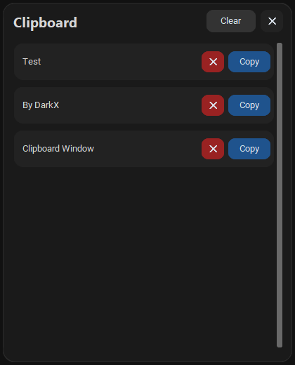

# Clipboard Manager

Modern and lightweight clipboard history manager for Windows.

Keep everything you copy in one clean and fast interface.


## Features

* Automatically saves copied text
* Quick access using hotkey
* Copy items again instantly
* Delete unwanted clipboard items
* Clear all clipboard history
* Minimal modern dark UI
* Lightweight and fast

## Screenshots



## How To Use

### Open Clipboard Window

Press:

```text
Ctrl + Shift + V
```

## Notes

* Clipboard history is automatically saved.
* The app runs quietly in the background.
* Only text clipboard content is currently supported.


## System Requirements

* Windows 10 / 11
* No installation required

## Download

Go to the Releases section and download the latest version.
